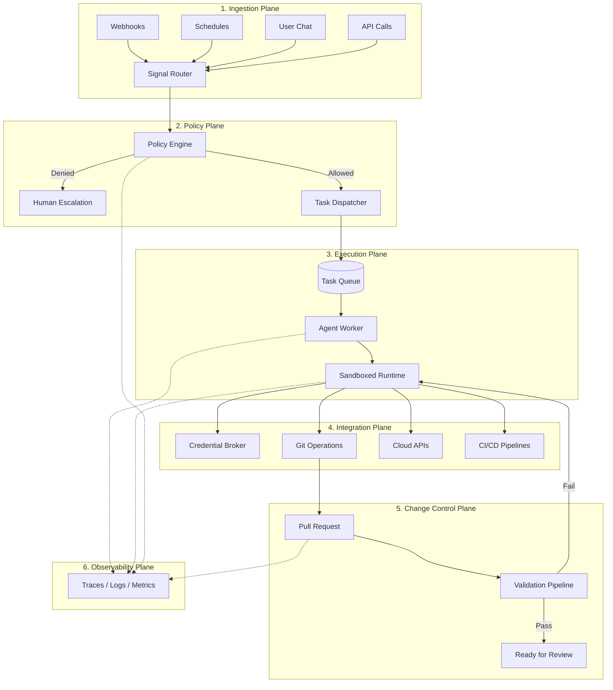
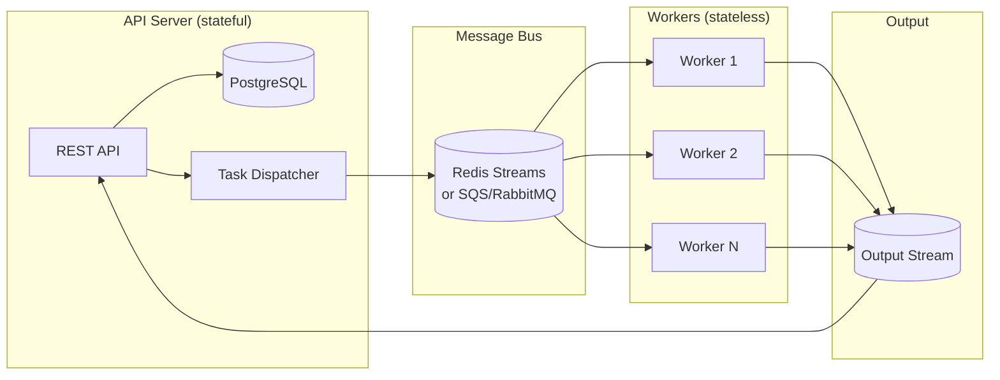
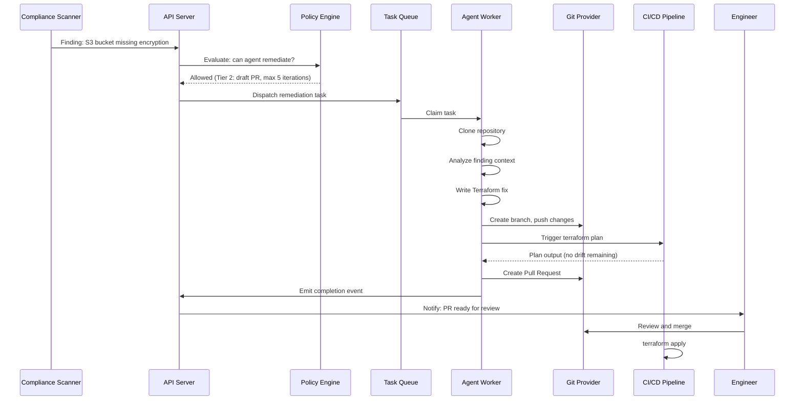

# 第 1 章：架构概览

> 生产级基础设施 agent system 的六个 plane。

---

## 全局视图

基础设施 agent system 不只是“一个带 tools 的 LLM”。它是一个 distributed system，其中不受信任的 language model output 会驱动高权限的基础设施操作。架构做对了，它就是生产力放大器。做错了，它就是 incident generator。

这个架构可拆分为 **六个相互作用的 plane**：



---

## Plane 1：Ingestion

工作如何进入系统。基础设施 agents 会响应多种 signal 类型：

| Signal Source | Example | Trigger Type |
|--------------|---------|-------------|
| Webhooks | GitHub PR opened、创建了 compliance finding | Event-driven |
| Schedules | 每日 drift scan、每周 compliance check | Time-driven |
| User chat | “修复这个 S3 bucket policy” | Interactive |
| API calls | CI/CD pipeline 触发 agent review | Programmatic |
| Alerts | PagerDuty incident、CloudWatch alarm | Reactive |

### 架构模式：Signal Router

```typescript
// All signals normalize into a common dispatch format
interface AgentTask {
  type: 'compliance-remediation' | 'drift-detection' | 'pr-review' | 'chat';
  trigger: {
    source: 'webhook' | 'schedule' | 'user' | 'api' | 'alert';
    sourceId: string;         // PR number, finding ID, etc.
    timestamp: string;
  };
  context: {
    organizationId: string;
    repositoryId?: string;
    agentSlug: string;        // Which agent handles this
    priority: 'low' | 'normal' | 'high' | 'critical';
  };
  payload: Record<string, unknown>;  // Agent-specific data
}
```

### Signal Ingestion 的备选方案

| Approach | Good For | Watch Out For |
|----------|----------|--------------|
| **Express/Fastify webhooks** | 简单、直接、易于 debug | 单点故障；需要处理 retry |
| **AWS API Gateway + Lambda** | Serverless、自动扩缩容 | cold start；本地开发更复杂 |
| **Azure Event Grid** | 原生 Azure webhook routing | vendor lock-in |
| **Temporal workflows** | 复杂的多步骤 trigger | operational overhead |

---

## Plane 2：Policy

policy plane 会在执行前为每一个 action 设置 gate。它会先判断 agents 被允许做什么，然后才允许它们执行。

### 核心概念：Autonomy Tiers

并非所有 action 的风险都相同。定义分级，并将每一级绑定到明确的 permissions：

```
┌──────────────────────────────────────────────────────────────┐
│  Tier 0: OBSERVE           只读。总结、分析。                │
│  ──────────────────────────────────────────────────────────  │
│  Tier 1: RECOMMEND         提出变更建议。不执行。            │
│  ──────────────────────────────────────────────────────────  │
│  Tier 2: DRAFT             创建 PR。不 merge/apply。         │
│  ──────────────────────────────────────────────────────────  │
│  Tier 3: SANDBOX EXECUTE   在隔离环境中运行。                │
│  ──────────────────────────────────────────────────────────  │
│  Tier 4: PROD WITH GATES   在带 approvals 的 prod 中执行。   │
└──────────────────────────────────────────────────────────────┘
```

### Policy Engine 模式

```typescript
interface PolicyDecision {
  allowed: boolean;
  tier: 0 | 1 | 2 | 3 | 4;
  reason: string;
  requiredApprovals?: string[];   // Human approvers needed
  constraints?: {
    maxIterations?: number;       // Prevent runaway loops
    timeoutMs?: number;           // Hard time limit
    allowedTools?: string[];      // Tool whitelist
    deniedTools?: string[];       // Tool blacklist
    requiresPR?: boolean;         // Must produce a PR
    requiresValidation?: boolean; // Must pass CI before PR
  };
}

function evaluatePolicy(
  task: AgentTask,
  orgPolicies: Policy[],
  agentConfig: AgentConfig
): PolicyDecision {
  // 1. Check org-level policies (e.g., "no prod changes without approval")
  // 2. Check agent-level constraints (e.g., max turns, allowed tools)
  // 3. Check resource-level rules (e.g., "production namespace = Tier 4")
  // 4. Return composite decision with most restrictive constraints
}
```

### Policy 来源

Policies 可以来自多个位置，并在 evaluation 时合并：

```typescript
// Policy digest: consolidated rules injected into agent context
interface PolicyDigest {
  organizationPolicies: string[];    // "Never modify production directly"
  agentHardRules: string[];          // "Max 10 drift iterations"
  repositoryConventions: string[];   // "Use modules/ for shared code"
  complianceFrameworks: string[];    // "SOC2: require encryption at rest"
}
```

---

## Plane 3：Execution

agents 实际运行的位置。关键架构规则是：

> **Workers 是 stateless 的，并且绝不会直接触碰数据库。**

这种分离意味着 workers 可以运行在任何地方，例如 Docker、Modal、Azure Container Apps、Lambda，而且即使 crash 也不会破坏 state。

### 参考架构



### 为什么数据库隔离很重要

| 如果 worker 直接触碰数据库…… | 采用数据库隔离后…… |
|----------------------------------|---------------------|
| worker crash 可能导致 state 不一致 | event 是原子性的；server 负责 reconcile |
| 需要在 worker environment 中放 DB credentials | workers 只需要 queue credentials |
| 扩 workers 就等于扩 DB connections | queue 吸收负载 |
| 测试时需要完整 DB setup | workers 可通过 mock queues 测试 |

### Task Queuing 的备选方案

| Technology | Strengths | Weaknesses | Best For |
|-----------|-----------|------------|----------|
| **Redis Streams** | 快、consumer groups、message persistence、内建 backpressure | 如果不持久化会有 data loss 风险；受 memory 限制 | 实时、低延迟 dispatch |
| **BullMQ** (Redis-backed) | 丰富的 job features（retry、delay、priority），Node.js 原生 | 绑定 Redis 和 Node.js | 以 Node.js 为中心的架构 |
| **AWS SQS + Lambda** | Serverless、可 scale to zero、dead-letter queues | 256KB message limit；eventual consistency | AWS-native、突发型 workload |
| **RabbitMQ** | 灵活 routing、成熟、久经验证 | operational overhead；clustering 复杂 | 需要复杂 routing 的场景 |
| **Temporal** | durable workflows、内建 retry/timeout、replay | runtime 较重；learning curve 高 | 长时间运行的多步骤 agent workflows |
| **PostgreSQL SKIP LOCKED** | 无需额外基础设施；具备 ACID guarantees | 基于 polling；无 pub/sub；吞吐受限 | 小规模、单数据库架构 |

---

## Plane 4：Integration

agents 如何与外部系统交互（cloud providers、git、CI/CD）。关键原则是：

> **agent 永远不持有 credentials。它只会按需向 credential broker 请求。**

完整模式见 [第 5 章：Credential Management](./05-credential-management-zh.md)。

### Integration Points

```
Agent Worker
  ├── Git Operations (clone, branch, commit, push, PR)
  ├── Cloud APIs (AWS/Azure/GCP via short-lived tokens)
  ├── CI/CD Pipelines (trigger plan/validate, poll results)
  ├── Compliance Scanners (Prowler, Checkov, custom)
  └── Communication (Slack, Teams, email for notifications)
```

---

## Plane 5：Change Control

每一个会修改基础设施的 agent action，都必须与人工变更走同一条 change pipeline。详见 [第 7 章：Change Control 与 GitOps](./07-change-control-zh.md)。

### 黄金法则

```
Agent writes code → Agent creates PR → CI validates → Human reviews → CI applies
```

**绝不能**：
```
Agent writes code → Agent applies directly to production
```

---

## Plane 6：Observability

agent actions 至少必须和人工 action 一样可观测。实际上，它们应该 *更* 可观测，因为 agent reasoning 本身是不透明的。详见 [第 9 章：Observability](./09-observability-zh.md)。

### 需要观测什么

| Layer | What to Capture | Why |
|-------|----------------|-----|
| **Agent decisions** | tool calls、reasoning steps、plan generation | debug 错误 action |
| **Policy evaluations** | 允许了什么 / 拒绝了什么、应用了哪些 rules | compliance audit |
| **Credential usage** | token minting、scope、expiry、实际发起的 API calls | security audit trail |
| **Infrastructure changes** | diffs、PR links、pipeline results | change attribution |
| **Performance** | latency、token usage、queue depth、error rates | 成本与可靠性 |

---

## 组合起来看：端到端流程

下面是一条完整的 compliance remediation 流程：



---

## 下一章

[第 2 章：Agent Runtime 与 Orchestration →](./02-agent-runtime-zh.md)
