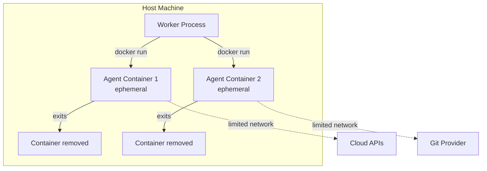
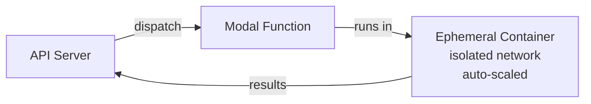
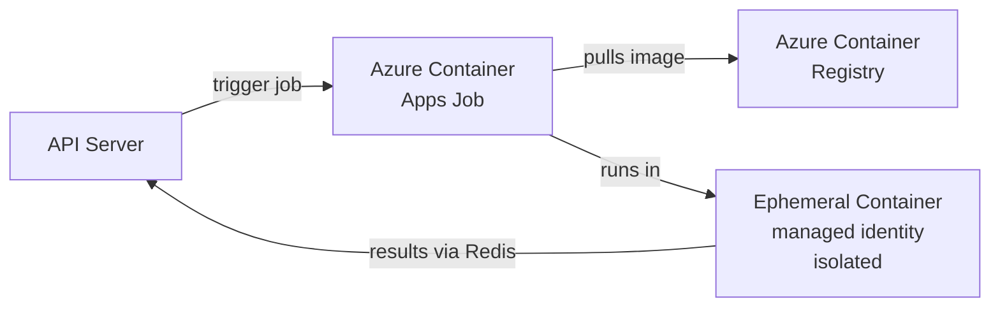

# 第 4 章：Sandboxed Execution

> 如何隔离 agent workload，从而确保即使 agent 被攻陷，也无法摧毁你的基础设施。

---

## 为什么你需要 Sandboxing

基础设施 agent 会执行代码、运行 CLI 工具，并与 cloud API 交互。如果 LLM 被操纵（通过 prompt injection、hallucination 或恶意 skill），blast radius 就等于该 agent 的访问级别。

如果没有 sandboxing：
- Agent 可以访问 host filesystem（你的 secrets、其他租户的数据）
- Agent 可以向任意 endpoint 发起 network call
- Agent 可以通过 host OS 提升权限
- 一次 crash 可能拖垮整个系统

Sandboxing 是 policy layer 失效时的兜底措施。即使 prompt 规则被绕过，sandbox 仍然能限制损害。

---

## Sandboxing 范围光谱

```
隔离性更弱                                               隔离性更强
─────────────────────────────────────────────────────────────────
  Process      Container    Container +      MicroVM      Full VM
  (Node.js     (Docker)     Network          (Firecracker) (EC2/Azure
   subprocess)              Policies                       VM)

  Fast          Fast        Medium           Fast          Slow
  No isolation  Good        Very good        Excellent     Maximum
  Free          Free        Free             Complex       Expensive
```

对于大多数基础设施 agent，**container + network policies** 是正确的权衡。

---

## 选项 1：Docker Containers（自管理）

这是最常见的方案。将每个 agent task 运行在一个 ephemeral container 中。

### 架构



### Docker Compose 示例

```yaml
# docker-compose.yml — Agent worker with sandbox
services:
  task-worker:
    build:
      context: .
      dockerfile: Dockerfile.worker
    environment:
      - REDIS_URL=redis://redis:6379
      - QUEUE_NAME=agent-tasks
    volumes:
      - /var/run/docker.sock:/var/run/docker.sock  # For spawning sandbox containers
    networks:
      - internal

  # Each agent task spawns one of these
  agent-sandbox:
    build:
      context: .
      dockerfile: Dockerfile.sandbox
    profiles: ["sandbox"]  # Not started by default
    read_only: true         # Read-only filesystem
    tmpfs:
      - /tmp:size=1G        # Writable temp space
      - /workspace:size=5G  # Git workspace
    security_opt:
      - no-new-privileges:true
    cap_drop:
      - ALL
    cap_add:
      - NET_RAW             # For DNS resolution
    mem_limit: 4g
    cpus: 2
    pids_limit: 256
    networks:
      - sandbox-net

networks:
  internal:
  sandbox-net:
    driver: bridge
    internal: false  # Allow outbound for git/cloud APIs
```

### Agent Sandbox 的 Dockerfile

```dockerfile
FROM node:22-slim

# Install IaC tools
RUN apt-get update && apt-get install -y --no-install-recommends \
    git curl unzip jq ca-certificates \
    && rm -rf /var/lib/apt/lists/*

# Terraform
RUN curl -fsSL https://releases.hashicorp.com/terraform/1.9.0/terraform_1.9.0_linux_amd64.zip \
    -o /tmp/terraform.zip && unzip /tmp/terraform.zip -d /usr/local/bin/ && rm /tmp/terraform.zip

# Azure CLI (if needed)
RUN curl -sL https://aka.ms/InstallAzureCLIDeb | bash

# Non-root user
RUN useradd -m -s /bin/bash agent
USER agent
WORKDIR /workspace

# No long-lived credentials baked in
# Credentials are injected at runtime via the credential broker
```

### 优点与缺点

| 优点 | 缺点 |
|------|------|
| 对环境拥有完全控制权 | 你需要自己管理基础设施 |
| 没有 cold start（镜像可预拉取） | Docker socket 访问本身是一个安全隐患 |
| 只要能运行 Docker 的地方都可用 | Container orchestration 复杂度更高 |
| 容易在本地调试 | 需要管理镜像更新 |

---

## 选项 2：Modal（Serverless Containers）

[Modal](https://modal.com) 提供 serverless container execution，cold start 可低至亚秒级。非常适合突发型的 agent workload。

### 架构



### 实现

```python
# modal_worker.py
import modal

app = modal.App("infra-agent-worker")

# Define the container image
agent_image = (
    modal.Image.debian_slim(python_version="3.12")
    .apt_install("git", "curl", "unzip", "jq")
    .run_commands(
        "curl -fsSL https://releases.hashicorp.com/terraform/1.9.0/"
        "terraform_1.9.0_linux_amd64.zip -o /tmp/tf.zip",
        "unzip /tmp/tf.zip -d /usr/local/bin/",
    )
    .pip_install("anthropic", "redis", "httpx")
)

@app.function(
    image=agent_image,
    timeout=30 * 60,        # 30 min max
    memory=4096,             # 4GB RAM
    cpu=2.0,
    secrets=[modal.Secret.from_name("agent-redis-credentials")],
    # Network: Modal handles isolation automatically
)
async def run_agent_task(task_payload: dict):
    """Execute a single agent task in an isolated Modal container."""
    import redis
    import anthropic

    # Connect to Redis for event streaming
    r = redis.from_url(os.environ["REDIS_URL"])

    # Run the agent
    client = anthropic.Anthropic()
    # ... agent execution logic ...

    # Emit completion event
    r.xadd(f"task:run:{task_payload['runId']}", {
        "type": "completed",
        "data": json.dumps(result),
    })
```

```typescript
// Dispatch from Node.js API server
async function dispatchToModal(task: AgentTask) {
  // Modal provides a REST API to trigger functions
  const response = await fetch('https://your-app--run-agent-task.modal.run', {
    method: 'POST',
    headers: {
      'Content-Type': 'application/json',
      'Authorization': `Bearer ${MODAL_TOKEN}`,
    },
    body: JSON.stringify(task.payload),
  });
}
```

### 优点与缺点

| 优点 | 缺点 |
|------|------|
| 零基础设施管理 | 供应商依赖 |
| 自动扩缩容（0 到 N） | Cold start（首次调用约 2 秒） |
| 按秒计费 | 配置依赖 Python SDK |
| 内建 secrets management | Egress 成本 |
| 支持 GPU workload | 对 networking 的控制更少 |

---

## 选项 3：Azure Container Apps Jobs

[Azure Container Apps Jobs](https://learn.microsoft.com/en-us/azure/container-apps/jobs) 可以按需运行 container，并使用 managed identity。非常适合 Azure 原生架构。

### 架构



### 实现

```typescript
// Dispatch — trigger an Azure Container App Job
import { ContainerAppsClient } from '@azure/arm-appcontainers';
import { DefaultAzureCredential } from '@azure/identity';

async function dispatchToContainerApp(task: AgentTask) {
  const client = new ContainerAppsClient(new DefaultAzureCredential(), SUBSCRIPTION_ID);

  await client.jobs.beginStart(
    RESOURCE_GROUP,
    JOB_NAME,
    {
      template: {
        containers: [{
          name: 'agent-worker',
          image: `${ACR_NAME}.azurecr.io/agent-worker:latest`,
          env: [
            { name: 'TASK_ID', value: task.id },
            { name: 'TASK_PAYLOAD', value: JSON.stringify(task.payload) },
            { name: 'REDIS_URL', secretRef: 'redis-url' },
          ],
          resources: { cpu: 2, memory: '4Gi' },
        }],
      },
    }
  );
}
```

```yaml
# Azure Container App Job definition (Bicep)
resource agentJob 'Microsoft.App/jobs@2024-03-01' = {
  name: 'agent-worker-job'
  location: location
  identity: {
    type: 'SystemAssigned'  # Managed Identity — no stored credentials
  }
  properties: {
    environmentId: containerAppEnv.id
    configuration: {
      triggerType: 'Manual'   # Triggered by API call
      replicaTimeout: 1800    # 30 min max
      replicaRetryLimit: 1
      secrets: [
        { name: 'redis-url', value: redisConnectionString }
      ]
    }
    template: {
      containers: [
        {
          name: 'agent-worker'
          image: '${acrName}.azurecr.io/agent-worker:latest'
          resources: { cpu: json('2.0'), memory: '4Gi' }
        }
      ]
    }
  }
}
```

### 优点与缺点

| 优点 | 缺点 |
|------|------|
| Managed Identity（无须存储 credentials） | 仅适用于 Azure |
| 自动缩容到零 | Cold start 约 10 秒 |
| 与 Azure networking 集成 | 可定制能力有限 |
| 通过 Azure Monitor 提供内建监控 | Job orchestration 能力较基础 |
| 支持私有资源的 VNET 集成 | 镜像拉取时间会增加启动时延 |

---

## 选项 4：AWS Lambda + ECS Tasks

对于 AWS 原生架构，短任务使用 Lambda，长任务使用 ECS Fargate。

```typescript
// Short tasks (<15min): Lambda
import { Lambda } from '@aws-sdk/client-lambda';

async function dispatchToLambda(task: AgentTask) {
  const lambda = new Lambda();
  await lambda.invoke({
    FunctionName: 'agent-worker',
    InvocationType: 'Event', // Async
    Payload: JSON.stringify(task.payload),
  });
}

// Long tasks (>15min): ECS Fargate
import { ECS } from '@aws-sdk/client-ecs';

async function dispatchToECS(task: AgentTask) {
  const ecs = new ECS();
  await ecs.runTask({
    cluster: 'agent-cluster',
    taskDefinition: 'agent-worker',
    launchType: 'FARGATE',
    overrides: {
      containerOverrides: [{
        name: 'agent-worker',
        environment: [
          { name: 'TASK_ID', value: task.id },
          { name: 'TASK_PAYLOAD', value: JSON.stringify(task.payload) },
        ],
      }],
    },
    networkConfiguration: {
      awsvpcConfiguration: {
        subnets: [PRIVATE_SUBNET],
        securityGroups: [AGENT_SG],
      },
    },
  });
}
```

---

## 选项 5：Kubernetes Jobs

控制力最强。将 agent task 作为 Kubernetes Job 运行，并配合 pod security policies。

```yaml
# agent-job.yaml
apiVersion: batch/v1
kind: Job
metadata:
  name: agent-task-${TASK_ID}
  namespace: agent-workers
spec:
  ttlSecondsAfterFinished: 300  # Clean up after 5 min
  backoffLimit: 1
  template:
    spec:
      serviceAccountName: agent-worker  # RBAC-scoped
      securityContext:
        runAsNonRoot: true
        runAsUser: 1000
        fsGroup: 1000
        seccompProfile:
          type: RuntimeDefault
      containers:
        - name: agent
          image: registry.example.com/agent-worker:latest
          resources:
            requests: { cpu: "1", memory: "2Gi" }
            limits: { cpu: "2", memory: "4Gi" }
          env:
            - name: TASK_PAYLOAD
              value: "${TASK_PAYLOAD}"
            - name: REDIS_URL
              valueFrom:
                secretKeyRef:
                  name: agent-secrets
                  key: redis-url
      restartPolicy: Never
      # Network policy applied at namespace level
```

```yaml
# Network policy: restrict agent egress
apiVersion: networking.k8s.io/v1
kind: NetworkPolicy
metadata:
  name: agent-egress
  namespace: agent-workers
spec:
  podSelector: {}
  policyTypes: [Egress]
  egress:
    - to:
        - ipBlock: { cidr: 0.0.0.0/0 }  # Allow outbound
      ports:
        - port: 443    # HTTPS (git, cloud APIs)
        - port: 6379   # Redis
    - to:
        - namespaceSelector:
            matchLabels: { name: kube-system }
      ports:
        - port: 53     # DNS
          protocol: UDP
```

---

## 对比矩阵

| Feature | Docker | Modal | Azure Container Apps | AWS Lambda/ECS | Kubernetes |
|---------|--------|-------|---------------------|----------------|------------|
| **Cold start** | ~0s（warm） | ~2s | ~10s | Lambda: ~1s, ECS: ~30s | ~5-30s |
| **Max runtime** | Unlimited | 24h | 24h | Lambda: 15m, ECS: unlimited | Unlimited |
| **Isolation** | Container | Container + network | Container + VNET | Lambda: microVM | Pod + network policy |
| **Scaling** | Manual | Automatic | Automatic | Automatic | HPA/KEDA |
| **Cost model** | Fixed | Per-second | Per-second | Per-request/second | Cluster + pod |
| **Managed identity** | DIY | Secrets mgmt | Native | IAM roles | Service accounts |
| **GPU support** | Yes | Yes | No | No（Lambda） | Yes |
| **Local dev** | Native | Modal CLI | Local emulator | SAM/LocalStack | Minikube/Kind |
| **Best for** | Dev/小规模场景 | Bursty, serverless | Azure-native | AWS-native | Multi-cloud, full control |

---

## Network Egress 控制

无论采用哪种 sandbox 技术，都应限制 outbound network access：

```
ALLOW:
  ├── Git providers (github.com, gitlab.com, dev.azure.com)
  ├── Cloud APIs (*.amazonaws.com, *.azure.com, *.googleapis.com)
  ├── IaC registries (registry.terraform.io)
  ├── Your Redis/message bus
  └── DNS resolution

DENY:
  ├── Internal networks (10.0.0.0/8, 172.16.0.0/12, 192.168.0.0/16)
  ├── Metadata endpoints (169.254.169.254)  ← CRITICAL
  ├── Other tenants' resources
  └── Everything else by default
```

> **Critical**：始终阻断 cloud metadata endpoints（169.254.169.254）。如果被攻陷的 agent 访问 metadata endpoint，它就可能窃取 instance credentials 并进一步提升权限。

---

## 下一章

[第 5 章：Credential Management →](./05-credential-management-zh.md)
