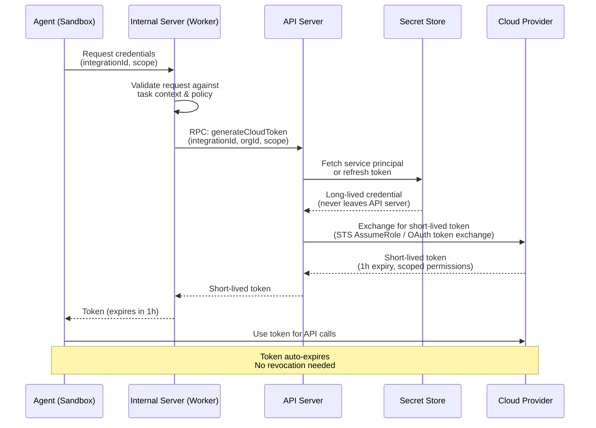

# 第 5 章：Credential Management

> 短期令牌、task-scoped access、vault 模式，以及 blast radius 控制。

---

## 基本铁律

> **Agents 绝不能持有 long-lived credentials。永远不要。**

环境变量里不要放 API keys。配置文件里不要放 service principal secrets。磁盘上不要放 SSH keys。Agent 应按需从 broker 请求 credentials，拿到一个权限范围最小化的短期 token，并且 token 会自动过期。

这里一旦做错，其他一切都没有意义。

---

## 如果不这样做，会发生什么

来自生产环境 agent 部署中的真实事件：
- 针对 agent config 目录的 **infostealer malware**，用于提取 API keys 和 auth tokens
- **Prompt injection** 诱导 agent 通过 tool calls 外泄 credentials
- **Framework CVEs** 使攻击者能够从序列化的 agent state 中提取 secrets

短期、细粒度 scope 的 tokens，能把这些原本灾难性的 breach 变成有时间边界的 incident。

---

## Credential Flow 架构



---

## 按 Cloud Provider 的实现方式

### AWS：STS AssumeRole

```typescript
import { STSClient, AssumeRoleCommand } from '@aws-sdk/client-sts';

async function generateAwsToken(
  integration: AwsIntegration,
  sessionName: string
): Promise<AwsCredentials> {
  const sts = new STSClient({ region: integration.defaultRegion });

  const response = await sts.send(new AssumeRoleCommand({
    RoleArn: integration.roleArn,        // Cross-account role
    RoleSessionName: `agent-${sessionName}`,
    DurationSeconds: 3600,               // 1 hour
    // Optional: further restrict permissions
    Policy: JSON.stringify({
      Version: '2012-10-17',
      Statement: [{
        Effect: 'Allow',
        Action: [
          's3:GetObject', 's3:PutObject',  // Only what's needed
          'ec2:Describe*',
        ],
        Resource: '*',
      }],
    }),
  }));

  return {
    accessKeyId: response.Credentials.AccessKeyId,
    secretAccessKey: response.Credentials.SecretAccessKey,
    sessionToken: response.Credentials.SessionToken,
    expiration: response.Credentials.Expiration,
  };
}
```

### Azure：OAuth Token Exchange

```typescript
import { ConfidentialClientApplication } from '@azure/msal-node';

async function generateAzureToken(
  integration: AzureIntegration,
  scope: string = 'https://management.azure.com/.default'
): Promise<AzureToken> {
  // For OAuth integrations: use refresh token
  if (integration.authMethod === 'OAuth') {
    const msalClient = new ConfidentialClientApplication({
      auth: {
        clientId: AZURE_APP_CLIENT_ID,
        clientSecret: AZURE_APP_CLIENT_SECRET,
        authority: `https://login.microsoftonline.com/${integration.tenantId}`,
      },
    });

    const result = await msalClient.acquireTokenByRefreshToken({
      refreshToken: integration.refreshToken,  // Stored encrypted
      scopes: [scope],
    });

    return {
      accessToken: result.accessToken,
      expiresOn: result.expiresOn,
      subscriptionId: integration.subscriptionId,
    };
  }

  // For service principal: client credentials flow
  // Still produces a short-lived token
  const result = await msalClient.acquireTokenByClientCredential({
    scopes: [scope],
  });

  return { accessToken: result.accessToken, expiresOn: result.expiresOn };
}
```

### GCP：Service Account Impersonation

```typescript
import { IAMCredentialsClient } from '@google-cloud/iam-credentials';

async function generateGcpToken(
  integration: GcpIntegration,
  scopes: string[] = ['https://www.googleapis.com/auth/cloud-platform']
): Promise<GcpToken> {
  const client = new IAMCredentialsClient();

  // Impersonate the service account to get a short-lived token
  const [response] = await client.generateAccessToken({
    name: `projects/-/serviceAccounts/${integration.serviceAccountEmail}`,
    scope: scopes,
    lifetime: { seconds: 3600 }, // 1 hour
  });

  return {
    accessToken: response.accessToken,
    expireTime: response.expireTime,
  };
}
```

---

## Credential Broker

Credential broker 位于 agent sandbox 与 secret store 之间。它会在签发短期 token 之前，针对当前 task 的 authorization context 校验每一次 credential request。

关键职责：
1. **Validate ownership**，确认请求的 cloud integration 属于当前 organisation，并且已授权给这个 task
2. **Enforce scope limits**，检查请求的 permissions 没有超出 policy 限制
3. **Generate short-lived tokens**，将 vault 中的 long-lived credentials 交换为给 agent 使用的 short-lived tokens
4. **Audit every issuance**，记录是哪个 agent、哪个 session、什么 scope，以及 token 何时过期

```typescript
// Example credential broker handler
async function handleGetCredentials(req: Request): Promise<Response> {
  const { integrationId, scope } = await req.json();
  const taskContext = getTaskContext(); // From the current execution context

  // 1. Validate integration belongs to this organization
  if (!taskContext.authorizedIntegrations.includes(integrationId)) {
    return Response.json(
      { error: 'Integration not authorized for this task' },
      { status: 403 }
    );
  }

  // 2. Validate scope is within allowed limits
  if (scope && !isAllowedScope(scope, taskContext.policy)) {
    return Response.json(
      { error: `Scope '${scope}' exceeds policy limits` },
      { status: 403 }
    );
  }

  // 3. Request short-lived token from the API server / vault
  const token = await requestCloudToken({
    integrationId,
    organizationId: taskContext.organizationId,
    scope,
    requestedBy: taskContext.agentId,
  });

  // 4. Log the credential issuance for audit
  await emitAuditEvent({
    type: 'credential_issued',
    integrationId,
    scope,
    agentId: taskContext.agentId,
    expiresAt: token.expiresAt,
  });

  return Response.json(token);
}
```

---

## Task-Scoped Credentials：让 Agents 可以放心自由运行

部署基础设施 agents 最难的部分不是技术，而是 trust。团队不愿意让 agent 自主运行，是因为一个权限过大的 credential 就可能造成真实损害。解决办法不是增加更多 approval gate，而是 **把 credentials 的 scope 收紧到即使 agent 想造成损害，也做不到**。

当一个 agent 对 AWS account 只有 read-only access，同时只对某个 repository 中的一个 Terraform 文件有 write access 时，你就可以让它自由运行。因为它**没有能力**做危险的事。这会把讨论从“我们是否应该让 agent 这么做？”转变成“agent 可以在这些边界内做任何它需要做的事。”

### 默认使用 Read-Only

每个 agent task 都应从最小 credential scope 开始。大多数 agent 操作都以读取为主：

| Task Type | Agent 实际需要什么 | Credential Scope |
|-----------|-------------------|-----------------|
| Compliance scan | 列出资源、读取配置 | **Read-only** cloud access |
| Drift detection | 运行 `terraform plan`（读取 state、进行比较） | **Read-only** cloud + read state |
| Code analysis | 读取 repository 文件、检查语法 | **Git read** only |
| Cost analysis | 查询 billing APIs、describe resources | **Read-only** billing + describe |
| Remediation | 修改 Terraform 文件、创建 branch、打开 PR | **Git write** + read-only cloud |
| Break-glass live execution | 在默认 PR-first 路径之外执行异常直接操作 | **Separate write** cloud credentials（罕见、隔离、强审计） |

注意，即使是 remediation，也通常只需要 **git write** 权限。Agent 修改代码并打开 PR。它不需要 cloud write access，因为 apply 由 CI/CD 负责。这是最安全、也是最常见的模式。

如果你确实支持 direct execution，那么应把它设计成 **不同的架构**，而不是在同一套 credential 上简单放大 scope。要有独立的 role、独立的 approval flow、独立的 audit trail，理想情况下还要有独立的 worker pool。

### 让 Scope 选择变得简单

系统应该让管理员容易配置，也让 agent 容易请求正确的 scope。预定义若干 named scopes，并将其映射到 cloud provider permissions：

```
SCOPES:
  read-only:
    AWS:   arn:aws:iam::*:role/agent-readonly    (Describe*, List*, Get*)
    Azure: Reader role on subscription
    GCP:   roles/viewer on project

  terraform-plan:
    AWS:   arn:aws:iam::*:role/agent-plan         (ReadOnly + state access)
    Azure: Reader + Terraform state storage access
    GCP:   roles/viewer + storage.objects.get (for state)

  git-write:
    GitHub: Contents (write), Pull Requests (write), limited to specific repos
    GitLab: Developer role on specific projects

  cloud-write:
    AWS:   arn:aws:iam::*:role/agent-apply         (scoped to specific services)
    Azure: Contributor on specific resource groups
    GCP:   roles/editor on specific projects
    ⚠️  Requires approval gate — never issued automatically
```

每种 agent 类型都映射到一个默认 scope。Compliance scanner 使用 `read-only`。Remediation agent 使用 `read-only` cloud + `git-write`。管理员可以按 task 覆盖，但默认值必须是安全的。

### 轻松切换 Credentials

Agent 经常在单个 task 中需要来自多个系统的 credentials，比如：
- cloud read access，用来理解当前 state
- git write access，用来推送修复
- 另一个 cloud account 的 read access，用来比较配置

Credential broker 应让不同 scope 之间的切换足够顺滑：

1. **Agent 按意图请求 credentials，而不是按原始 IAM policy。** 它请求的是“对 production AWS account 的 read-only access”，而不是某个具体的 role ARN。Broker 负责把意图映射到正确 credential。

2. **一个 session 中支持多个 credentials。** Agent 可以同时持有一个 read-only cloud token 和一个 git write token。每个 token 都独立 scope。撤销其中一个，不影响另一个。

3. **Scope escalation 必须显式发生。** 如果一个 task 从 read-only analysis 开始，但 agent 之后判断自己需要 write access 才能修复问题，它应显式请求升级。Broker 可以要求人工审批该升级，而不会中断已经完成的只读工作。

4. **Credentials 可以跨 cloud providers 进行切换。** 一个跨 AWS 和 Azure 的 multi-cloud agent，会分别拿到各自独立的 token，每个 token 都有自己的 scope 和 expiry。Agent 不管理 credentials，它只按 provider 和 intent 请求 access。

### 为什么这很重要

当 credentials 被正确 scope 之后：
- **Agents 可以在不引发恐惧的前提下自主运行。** 一个 read-only agent 可以分析你的全部基础设施，而它最糟糕能做的也只是浪费 tokens。
- **用户会信任系统。** 他们能看到 compliance scanner **从字面意义上就不可能**修改资源。这不是可能被绕过的 policy，而是一个根本不具备写权限的 credential。
- **Blast radius 是有边界的。** 即使 agent 因 prompt injection 被攻陷，它手里的 token 也只能执行 scope 允许的操作。对于想修改基础设施的攻击者来说，read-only token 没有价值。
- **Audit 变得有意义。** 每次 credential issuance 都会记录 scope，因此你可以准确看到每个 agent session 拥有什么级别的 access，不仅仅是它“本来可能”做什么，而是它“被授权”做什么。

目标是：**管理员配置一次 scopes，agents 按 intent 请求 credentials，系统保证任何 agent 拿到的 access 都不会超过其 task 所需。**

---

## Secret Storage 备选方案

### HashiCorp Vault

```typescript
import Vault from 'node-vault';

const vault = Vault({
  endpoint: process.env.VAULT_ADDR,
  token: process.env.VAULT_TOKEN,
});

// Store integration credentials
await vault.write('secret/data/integrations/aws-prod', {
  data: {
    roleArn: 'arn:aws:iam::123456789:role/agent-role',
    externalId: 'infra-agent-platform',
  },
});

// Read at token generation time (API server only)
const secret = await vault.read('secret/data/integrations/aws-prod');
```

### AWS Secrets Manager

```typescript
import { SecretsManager } from '@aws-sdk/client-secrets-manager';

const sm = new SecretsManager();
const secret = await sm.getSecretValue({
  SecretId: `integrations/${integrationId}`,
});
const credentials = JSON.parse(secret.SecretString);
```

### Azure Key Vault

```typescript
import { SecretClient } from '@azure/keyvault-secrets';
import { DefaultAzureCredential } from '@azure/identity';

const client = new SecretClient(
  `https://${VAULT_NAME}.vault.azure.net`,
  new DefaultAzureCredential()
);

const secret = await client.getSecret(`integration-${integrationId}`);
```

### 1Password（通过 Connect Server）

```typescript
const response = await fetch(`${OP_CONNECT_URL}/v1/vaults/${VAULT_ID}/items/${ITEM_ID}`, {
  headers: { 'Authorization': `Bearer ${OP_TOKEN}` },
});
const item = await response.json();
```

---

## Defense-in-Depth 检查清单

```
[ ] Long-lived credentials ONLY in API server / vault — never in workers
[ ] Short-lived tokens (1h max) for all agent operations
[ ] Default scope is read-only — write access requires explicit configuration
[ ] Named scopes defined per cloud provider (read-only, plan, git-write, cloud-write)
[ ] Each agent type mapped to a default scope — overrides require admin action
[ ] Scope tokens to minimum required permissions (inline policy / session tags)
[ ] Validate integration ownership before issuing tokens
[ ] Log every credential issuance with scope and correlation ID
[ ] Block cloud metadata endpoints in sandbox (169.254.169.254)
[ ] Encrypt credentials at rest in the database
[ ] Rotate refresh tokens on a schedule
[ ] Credential requests fail closed (deny on error)
[ ] No credentials in agent prompts, logs, or error messages
[ ] Scope escalation (read → write) requires human approval
```

---

## 需要避免的 Anti-Patterns

| Anti-Pattern | 为什么危险 | 更好的做法 |
|-------------|-----------|-----------|
| 把 API keys 放到 env vars | 所有进程都可见，crash 时还可能被记录 | 使用 credential broker + short-lived tokens |
| 在 agent config 中存放 service principal secrets | 会被 infostealer 窃取，也可能在序列化时泄漏 | 使用 managed identity 或基于 vault 的 token generation |
| 使用 long-lived OAuth tokens | 一旦泄漏，blast radius 很大 | 在 vault 中存 refresh token，对外只发 short-lived access tokens |
| Agents 之间共享 credentials | 一个 agent 被攻陷，全部 agent 一起失守 | 按 agent、按 session 单独签发 token |
| 在 LLM prompts 中放 credentials | Model 可能在输出中复述它们 | 注入到 tool environment，而不是 prompt text |
| Credentials 永不过期 | 被窃取后可永久使用 | 使用 1 小时 TTL，且不允许续期 |

---

## 下一章

[第 6 章：The Data Plane →](./06-data-plane-zh.md)
