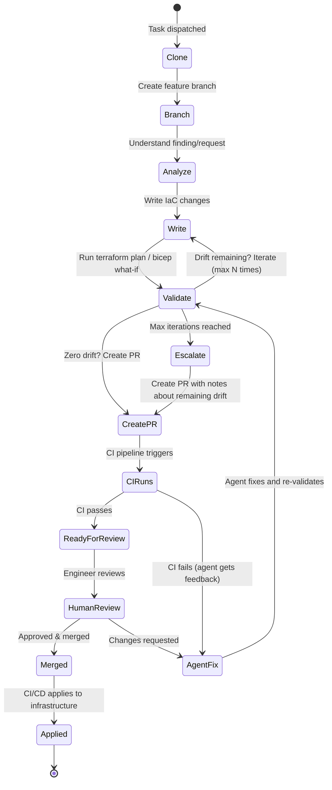

# 第 7 章：Change Control & GitOps

> 基于 PR 的工作流、drift verification loops，以及 validation gates。

---

## 黄金法则（再次强调）

```
Agent writes code → Agent creates PR → CI validates → Human reviews → CI applies
```

把这当作一个硬性的架构约束，而不是指导建议。

如果你确实支持 emergency direct execution，那也应把它视为一个**独立的 break-glass system**，放在默认路径之外。它不应与 PR-first flow 共享同样的 worker 假设、credentials 或 risk posture。

---

## 为什么要使用基于 PR 的 Change Control

| Without PR workflow | With PR workflow |
|--------------------|-----------------|
| Agent 直接 apply 到 prod | Agent 产出可审阅的 diff |
| 不知道到底改了什么，也没有 audit trail | 每一次变更都有完整 git history |
| 没有 rollback 路径 | `git revert` 可恢复到先前状态 |
| 没有人类检查点 | merge 前有人 review |
| 很难理解 agent 的 reasoning | PR description 负责解释为什么这么改 |
| 一个坏决定 = outage | 一个坏决定 = PR 被关闭 |

---

## Agent PR 生命周期



---

## PR 前的 Validation Loop

最重要的模式是：**在验证变更之前，绝不要创建 PR**。

```typescript
async function validateAndCreatePR(
  context: AgentContext,
  maxIterations: number = 10
): Promise<PRResult> {
  for (let i = 0; i < maxIterations; i++) {
    // 1. Run the IaC validation pipeline
    const planResult = await triggerPipeline(context.pipelineId, 'PLAN');

    // 2. Check for remaining drift
    if (planResult.driftResources.length === 0) {
      // No drift — safe to create PR
      return await createPullRequest(context, {
        title: `fix: ${context.findingTitle}`,
        body: formatPRBody(context, planResult),
        validationPassed: true,
        iterations: i + 1,
      });
    }

    // 3. Feed plan output back to agent for correction
    const feedback = formatDriftFeedback(planResult);
    await agentSession.continue(
      `Plan shows ${planResult.driftResources.length} remaining drift items:\n${feedback}\n` +
      `Please fix these issues. Iteration ${i + 1}/${maxIterations}.`
    );
  }

  // Max iterations reached — create PR anyway with documentation
  return await createPullRequest(context, {
    title: `fix: ${context.findingTitle} (needs review)`,
    body: formatPRBody(context, lastPlanResult, {
      note: `Agent reached max iterations (${maxIterations}). Remaining drift documented below.`,
    }),
    validationPassed: false,
    iterations: maxIterations,
  });
}
```

---

## Proposal Plane

在 PR 还不存在之前，用户仍然需要理解 agent **认为自己正在修改什么**。因此应在原始 file diffs 之外，保留一份结构化的 proposal model。

有价值的 proposal artifacts 包括：

- planned resources 和 relationships
- 预估的 fixed cost 与 usage-based cost impact
- validation status 和 iteration count
- 被触碰文件的 ground-truth snapshots，用于 diff reconciliation

这能支持一批实质性增强 trust 的产品能力：

- 使用 graph overlays，而不是直接阅读原始 Terraform plan JSON
- 在 branch 或 PR 定稿前提供 cost previews
- 在重连或 worker 重启后保持稳定的 UI state
- 更清晰的人类 review，因为“意图”和“transcript”被分离开了

换句话说，不要让 PR description 或 chat transcript 独自承担全部 review 负担。

---

## Deterministic Validation：不要只相信 LLM

LLM 能生成看起来合理的 IaC，但它们也会 hallucinate resource names、编造不存在的 arguments，并忽略 cost implications。解决办法是：在创建 PR 之前，对所有生成的变更运行 deterministic tools。它们会返回硬性的 pass/fail 结果，不存在概率，也不存在“我觉得这应该是对的”。

Agent 应按顺序串联这些检查，并在第一处错误时快速失败：

```
terraform fmt -check     ← formatting
       │
terraform validate       ← syntax & type errors
       │
tflint                   ← provider-specific rules (invalid AMI, wrong region)
       │
checkov / trivy          ← security misconfigurations (CIS, NIST, PCI-DSS)
       │
conftest                 ← custom org policies (OPA/Rego)
       │
infracost                ← cost estimate (flag if > budget threshold)
       │
terraform plan           ← actual cloud API dry-run (catches runtime errors)
       │
access analyzer          ← IAM policy validation (AWS) / policy compliance (Azure)
```

每一步在失败时都会返回非零退出码。Agent 读取错误输出，修复问题，然后重跑。这就是上一节中的 iteration loop，只不过这次 agent 获得的是远比“plan failed”更丰富、更可解析的反馈。

### Open-Source Validation Tools

#### Security & Compliance Scanning

在生成的 `.tf`、`.yaml`、`.bicep` 或 `.json` 文件到达 PR 之前，对它们运行以下工具：

| Tool | 能发现什么 | 扫描对象 | Stars |
|------|-----------|---------|-------|
| [Checkov](https://github.com/bridgecrewio/checkov) | 1,000+ security policies（CIS、NIST、PCI-DSS、HIPAA） | Terraform、CloudFormation、Bicep、Kubernetes、Helm、Dockerfile | ~8.5k |
| [Trivy](https://github.com/aquasecurity/trivy)（IaC mode） | IaC 文件中的 misconfigurations、vulnerabilities、secrets | Terraform、CloudFormation、Bicep、Kubernetes、Dockerfile | ~32k |
| [Prowler](https://github.com/prowler-cloud/prowler) | Cloud account posture（CIS、SOC2、GDPR、HIPAA），直接扫描 live accounts | AWS、Azure、GCP、Kubernetes | ~12k |
| [KICS](https://github.com/Checkmarx/kics) | 2,400+ IaC misconfiguration 查询规则 | Terraform、CloudFormation、Ansible、Kubernetes、Pulumi、CDK | ~2.5k |
| [Terrascan](https://github.com/tenable/terrascan) | 500+ 基于 OPA/Rego 的 policy，覆盖 CIS benchmarks | Terraform、Kubernetes、Helm、CloudFormation、Dockerfile | ~5.2k |
| [ScoutSuite](https://github.com/nccgroup/ScoutSuite) | Multi-cloud security audit（通过 cloud APIs 收集配置） | AWS、Azure、GCP、Alibaba、Oracle Cloud | ~7.2k |
| [Semgrep](https://github.com/semgrep/semgrep) | 自定义 pattern-matching rules（灵活，可自编写） | 30+ languages，包括 HCL | ~14k |

**Agent 用法**：`checkov -d . --framework terraform --compact --quiet` 或 `trivy config . --exit-code 1`。解析 JSON output，把失败项反馈回 agent context，再迭代。

#### Cost Estimation

| Tool | 它做什么 | Stars |
|------|---------|-------|
| [Infracost](https://github.com/infracost/infracost) | 展示 Terraform 变更的月度成本估算，并与当前 state 做 diff | ~11k |
| [OpenCost](https://github.com/opencost/opencost) | Kubernetes workload 的实时成本分摊（CNCF incubating） | ~6.4k |

**Agent 用法**：`infracost breakdown --path . --format json`。检查 `totalMonthlyCost` 是否超过预算阈值，并把估算结果写进 PR body，让 reviewer 能看到成本影响。

Cloud providers 也提供 pricing APIs，可用于自定义成本检查：
- **AWS**：[Pricing API](https://docs.aws.amazon.com/awsaccountbilling/latest/aboutv2/price-changes.html)，可编程访问各服务价格
- **Azure**：[Retail Prices API](https://learn.microsoft.com/en-us/rest/api/cost-management/retail-prices/azure-retail-prices)，无需认证的 REST API，无需 subscription
- **GCP**：[Cloud Billing Catalog API](https://cloud.google.com/billing/docs/reference/rest)，列出所有 services 和 SKUs 及定价

#### Linting & Formatting

| Tool | 能发现什么 | Stars |
|------|-----------|-------|
| [TFLint](https://github.com/terraform-linters/tflint) | `terraform plan` 抓不到的错误，例如无效 AMI IDs、已弃用 arguments、provider-specific rules | ~5.6k |
| [cfn-lint](https://github.com/aws-cloudformation/cfn-lint) | CloudFormation template 错误（schema、best practices、自定义规则） | ~2.6k |
| [terraform-docs](https://github.com/terraform-docs/terraform-docs) | 缺失的 module 文档、不完整的 input/output 描述 | ~4.6k |
| [Terratag](https://github.com/env0/terratag) | 资源上缺少 tags（强制执行 tagging policies） | ~1k |
| [Pike](https://github.com/JamesWoolfenden/pike) | 计算 apply 生成代码所需的最小 IAM permissions | ~800 |
| `terraform fmt -check` | 规范格式 | built-in |
| `terraform validate` | 语法和内部一致性检查（不发 provider calls） | built-in |
| `az bicep lint` | Bicep 语法错误与 best practice 违规 | built-in |

#### Policy-as-Code Engines

编写你自己的组织特定规则，并对每次生成的变更强制执行：

| Tool | 它做什么 | Stars |
|------|---------|-------|
| [OPA](https://github.com/open-policy-agent/opa) | 通用 policy engine（Rego 语言），CNCF graduated | ~11.2k |
| [Conftest](https://github.com/open-policy-agent/conftest) | 对 Terraform plan JSON、Kubernetes manifests、Dockerfiles 运行 OPA/Rego policies | ~3.1k |
| [Kyverno](https://github.com/kyverno/kyverno) | Kubernetes-native policy engine（YAML policies，无需 Rego），CNCF graduated | ~7.4k |
| [Cloud Custodian](https://github.com/cloud-custodian/cloud-custodian) | 基于 YAML 的 cloud security、cost 和 governance rules engine（CNCF incubating） | ~5.8k |

**Agent 用法**：`terraform show -json plan.tfplan | conftest test -`，把你的 Rego policies 运行在实际 plan output 上，不只是源文件，而是变量都已经展开后的 resolved plan。

#### Drift Detection

| Tool | 它做什么 | Stars |
|------|---------|-------|
| `terraform plan -refresh-only` | 检测 Terraform state 与实际 cloud resources 之间的 drift | built-in |
| [Terramate](https://github.com/terramate-io/terramate) | 具备内建 drift detection 和 Slack notifications 的 IaC orchestration 工具 | ~3.4k |
| [driftctl](https://github.com/snyk/driftctl) | 对比 Terraform state 与实际 cloud resources（maintenance mode） | ~2.4k |
| [cloud-nuke](https://github.com/gruntwork-io/cloud-nuke) | 删除 cloud accounts 中的 orphaned resources（cleanup tool） | ~3.1k |

### Cloud Provider Validation APIs

这些 APIs 能让 agents 在真实 cloud environment 上验证生成的代码，从而捕获静态分析无法发现的错误，比如 quota limits、命名冲突、权限问题。

#### AWS

| API | 它验证什么 |
|-----|-----------|
| [IAM Access Analyzer — ValidatePolicy](https://docs.aws.amazon.com/access-analyzer/latest/APIReference/API_ValidatePolicy.html) | 检查 IAM policy JSON 的语法和 best practices，返回安全 warnings 与 errors |
| [IAM Access Analyzer — CheckNoNewAccess](https://docs.aws.amazon.com/access-analyzer/latest/APIReference/API_CheckNoNewAccess.html) | 比较新旧 IAM policy，返回是否引入新权限的 PASS/FAIL |
| [IAM Policy Simulator](https://docs.aws.amazon.com/IAM/latest/APIReference/API_SimulateCustomPolicy.html) | 模拟 policy 是否允许或拒绝特定 API actions，可在部署前测试 |
| [Config — StartResourceEvaluation](https://docs.aws.amazon.com/config/latest/APIReference/API_StartResourceEvaluation.html) | 在资源尚未存在前，就按 Config rules 评估其配置，属于 proactive compliance |
| [CloudFormation Change Sets](https://docs.aws.amazon.com/AWSCloudFormation/latest/APIReference/API_CreateChangeSet.html) | 在不部署的前提下预览 stack changes，可捕获无效属性、命名冲突、S3 约束等 |
| [Trusted Advisor API](https://docs.aws.amazon.com/awssupport/latest/user/get-started-with-aws-trusted-advisor-api.html) | 成本优化、安全、容错、service limits。需要 Business Support+ |

#### Azure

| API | 它验证什么 |
|-----|-----------|
| [ARM/Bicep What-If](https://learn.microsoft.com/en-us/azure/azure-resource-manager/bicep/deploy-what-if) | 预测 resource changes 而不执行部署，`az deployment group what-if` 同时适用于 Bicep 和 ARM |
| [Policy Compliance API](https://learn.microsoft.com/en-us/azure/governance/policy/how-to/get-compliance-data) | 通过 `PolicyStates` 操作查询 subscriptions 和 management groups 的 compliance states |
| [Advisor REST API](https://learn.microsoft.com/en-us/rest/api/advisor/) | Security、performance、cost、reliability recommendations，可检查生成资源是否触发 warnings |
| [Resource Graph](https://learn.microsoft.com/en-us/rest/api/azure-resourcegraph/) | 使用 KQL 大规模查询 resources，可在生成代码前检查命名冲突和现有资源 |

#### GCP

| API | 它验证什么 |
|-----|-----------|
| [Policy Analyzer](https://docs.cloud.google.com/policy-intelligence/docs/policy-analyzer-overview) | 分析 IAM access relationships，即“谁可以访问什么”，可用于验证生成的 IAM bindings |
| [Recommender API](https://docs.cloud.google.com/recommender/docs/reference/rest) | 成本、安全、性能 recommendations，可将生成资源对照 GCP best practices 进行检查 |
| [Cloud Asset Inventory](https://docs.cloud.google.com/asset-inventory/docs/reference/rest) | 搜索现有资源、检查命名冲突，并在生成代码前理解当前 state |
| [Security Command Center](https://docs.cloud.google.com/security-command-center/docs/reference/rest) | 提供 GCP 全局安全 findings，可检查将要生成的基础设施是否已存在已知风险 |

#### OCI

| API | 它验证什么 |
|-----|-----------|
| [Cloud Guard](https://docs.oracle.com/en-us/iaas/cloud-guard/using/index.htm) | 基于 detector 和 responder recipes 的 security posture monitoring |
| [Cloud Advisor](https://docs.oracle.com/en-us/iaas/Content/CloudAdvisor/Concepts/cloudadvisoroverview.htm) | 成本优化和安全 recommendations |

### 为什么这会影响 Agent 质量

LLM 很擅长生成结构上正确的 IaC，但它们不擅长：
- 知道当前的 cloud pricing（训练数据通常已过时数月）
- 检查一个 resource name 在你的 account 中是否已经存在
- 验证 IAM policies 是否真的授予了预期 access
- 记住你组织自己的 compliance requirements

Deterministic tools 能补上这些空缺。Agent 负责生成代码，tools 负责验证代码。当 tool 失败时，agent 得到的是具体、可解析的错误输出，这比“plan failed”强得多。这就是从“AI 生成 IaC”走向“AI 生成且能通过与人类代码相同 CI 检查的 IaC”的关键。

---

## Multi-Environment Validation（矩阵式 Pipelines）

基础设施通常横跨多个 environments。一次 pipeline run 就可能同时产出 dev、staging 和 prod 的 artifacts：

```typescript
interface PipelineResult {
  runId: string;
  status: 'success' | 'failure';
  // Matrix dimensions (environments)
  dimensions?: string[];  // e.g., ['dev', 'staging', 'prod']
  outputs: {
    plan: {
      // Flat (single environment)
      parsed?: PlanOutput;
      // Or per-dimension
      [dimension: string]: { parsed: PlanOutput } | undefined;
    };
  };
}

// Check all dimensions for drift
function hasRemainingDrift(result: PipelineResult): boolean {
  if (result.dimensions?.length) {
    return result.dimensions.some(dim => {
      const output = result.outputs.plan[dim]?.parsed;
      return output?.driftResources?.length > 0;
    });
  }
  return (result.outputs.plan.parsed?.driftResources?.length ?? 0) > 0;
}
```

---

## PR Body 格式

在 PR body 中给 reviewer 完整 context：

```markdown
## Summary
Fixes compliance finding: S3 bucket `my-bucket` missing server-side encryption.

## Changes
- Added `server_side_encryption_configuration` block to `modules/storage/main.tf`
- Set default encryption to `aws:kms` with auto-generated key

## Validation
- Terraform plan: **PASSED** (0 drift remaining)
- Iterations: 2 (first attempt had syntax error)
- Environment: production

## Plan Output
```hcl
# aws_s3_bucket.my_bucket will be updated in-place
~ resource "aws_s3_bucket" "my_bucket" {
    + server_side_encryption_configuration {
        + rule {
            + apply_server_side_encryption_by_default {
                + sse_algorithm = "aws:kms"
              }
          }
      }
  }
```

## Finding Details
- Source: Prowler
- Severity: HIGH
- Framework: CIS AWS Benchmark v3.0
- Control: 2.1.1 - Ensure S3 bucket has server-side encryption enabled

```

---

## CI/CD Integration Patterns

### GitHub Actions

```yaml
# .github/workflows/terraform-plan.yml
name: Terraform Plan
on:
  pull_request:
    paths: ['**/*.tf', '**/*.tfvars']

jobs:
  plan:
    runs-on: ubuntu-latest
    permissions:
      pull-requests: write
      id-token: write  # For OIDC auth
    steps:
      - uses: actions/checkout@v4
      - uses: hashicorp/setup-terraform@v3

      - name: Terraform Init
        run: terraform init

      - name: Terraform Plan
        id: plan
        run: terraform plan -out=plan.tfplan -json > plan.json

      - name: Upload Plan Artifact
        uses: actions/upload-artifact@v4
        with:
          name: terraform-plan
          path: plan.json

      - name: Comment PR
        uses: actions/github-script@v7
        with:
          script: |
            const plan = require('./plan.json');
            // Post plan summary as PR comment
```

### GitLab CI

```yaml
# .gitlab-ci.yml
terraform-plan:
  stage: validate
  image: hashicorp/terraform:1.9
  script:
    - terraform init
    - terraform plan -out=plan.tfplan
    - terraform show -json plan.tfplan > plan.json
  artifacts:
    paths: [plan.json]
    expire_in: 1 hour
  rules:
    - if: '$CI_PIPELINE_SOURCE == "merge_request_event"'
      changes: ['**/*.tf', '**/*.tfvars']
```

### Atlantis（专用 Terraform CI）

```yaml
# atlantis.yaml
version: 3
projects:
  - dir: infrastructure/
    autoplan:
      when_modified: ['**/*.tf', '**/*.tfvars']
      enabled: true
    workflow: default
    apply_requirements: [approved, mergeable]

workflows:
  default:
    plan:
      steps:
        - init
        - plan:
            extra_args: ["-json"]
    apply:
      steps:
        - apply
```

### Spacelift

```yaml
# .spacelift/config.yml
version: "1"
stacks:
  production:
    project_root: infrastructure/
    terraform_version: "1.9.0"
    auto_apply: false  # Require manual approval
    before_plan:
      - checkov -d . --framework terraform
```

---

## Branch Naming Conventions

让 agent branches 清晰可识别，并保持有序。一个常见模式是：

```
agent/{agent-type}/{task-reference}/{unique-suffix}
```

示例：
- `agent/remediation/finding-abc123/m4k7x2`
- `agent/drift-fix/vpc-encryption/a9b3c1`
- `agent/pr-review/issue-456/x2y4z6`

`agent/` 前缀让你更容易在 CI rules、branch protection 和 cleanup scripts 中筛选 agent 创建的 branches。唯一后缀则能防止多个 agents 并发处理同一个 finding 时发生冲突。
```

---

## Hard Rules（System Prompt Constraints）

把安全规则直接编码进 agent 的 system prompt：

```markdown
## Hard Rules — NEVER violate these

1. NEVER push directly to main or master branch
2. NEVER run `terraform apply` or `az deployment create` — only plan/what-if
3. NEVER create a PR until the validation pipeline shows zero drift
4. ALWAYS create a new branch for changes
5. ALWAYS include the finding ID and validation results in the PR body
6. If you reach 10 plan iterations without zero drift, create the PR anyway
   with full documentation of remaining drift
7. NEVER modify files outside the repository's IaC directories
8. ALWAYS commit with a descriptive message referencing the finding
9. If break-glass execution exists in your platform, it MUST use a separate workflow and credentials
```

---

## 下一章

[第 8 章：Policy & Guardrails →](./08-policy-guardrails-zh.md)
