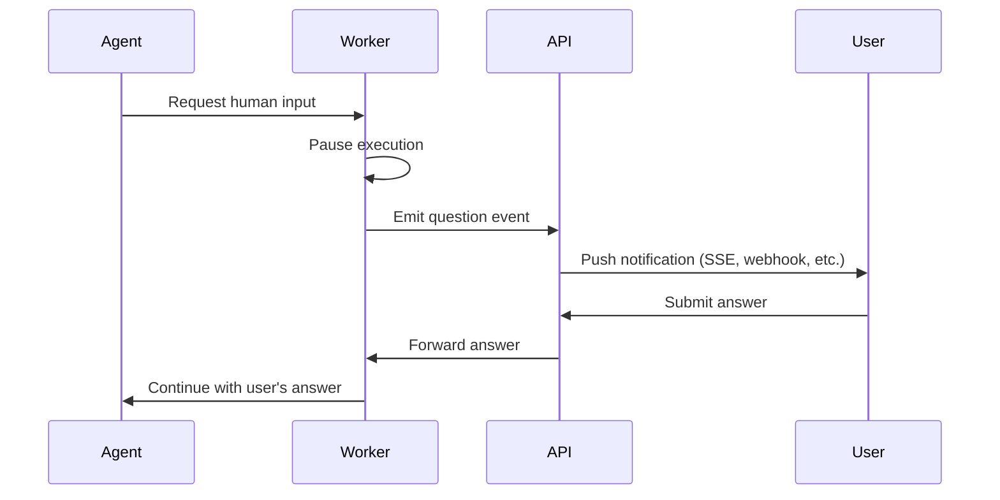

# 第 8 章：Policy 与 Guardrails

> Tool restrictions、approval gates、autonomy tiers、policy-as-code generation，以及组织级 policy enforcement。

---

## Policy Plane

Policy 决定 agent 实际上被允许做什么。LLM 决定要做什么，policy 决定这件事是否被允许。

本章覆盖完整的 policy stack：从 agent 无法绕过的结构性约束，到引导其行为的 prompt-level rules，再到验证每一次 action 的 runtime enforcement；以及关键的一点，agent 如何从软规则中**生成可执行的 policy**，从而闭合 human intent 与 machine enforcement 之间的回路。

---

## 三层 Guardrails

```
┌────────────────────────────────────────────────────┐
│  Layer 1: STRUCTURAL GUARDRAILS                    │
│  Built into architecture. Cannot be bypassed.      │
│  • Workers can't access DB                         │
│  • Sandbox containers have network restrictions    │
│  • Credential broker validates every request       │
│  • Max iteration limits enforced in code           │
└───────────────────────┬────────────────────────────┘
                        │
┌───────────────────────▼────────────────────────────┐
│  Layer 2: PROMPT-LEVEL RULES                       │
│  Encoded in system prompts. Model-enforced.        │
│  • "Never push to main"                            │
│  • "Always validate before PR"                     │
│  • "Max 10 drift iterations"                       │
│  • Organization-specific policies                  │
└───────────────────────┬────────────────────────────┘
                        │
┌───────────────────────▼────────────────────────────┐
│  Layer 3: RUNTIME POLICY ENGINE                    │
│  Evaluated at dispatch and tool-call time.         │
│  • Tool allow/deny lists                           │
│  • Autonomy tier enforcement                       │
│  • Human approval requirements                     │
│  • Budget/rate limits                              │
└────────────────────────────────────────────────────┘
```

Layer 2（prompt rules）是最弱的一层，因为 model 可以被操纵。Layer 1 和 Layer 3 必须兜住 Layer 2 漏掉的部分。但 Layer 2 有一个独特优势：它是唯一理解 *intent* 的一层。model 可以读取诸如 “all S3 buckets must be encrypted” 这样的 policy，并生成用于结构化 enforcement 的 Terraform、Azure Policy definition 或 OPA rule。软性 guardrails 也正是借此变成硬性 guardrails，agent 自己补上这段缺口。

---

## Tool Allow/Deny Lists

每种 agent type 都应有一份显式的 tool allow/deny list。这属于结构性 guardrail，必须在 runtime level 而不是 prompt level enforced。

```yaml
# Example: tool permissions per agent type
agent_types:
  compliance-scanner:
    allowed_tools:
      - read-file
      - git-diff
      - git-log
      - describe-resource
      - list-resources
      - query-findings
    denied_tools:
      - write-file
      - git-push
      - git-commit
      - terraform-apply
      - kubectl-apply
      - cloud-credentials:write

  remediation-agent:
    allowed_tools:
      - read-file
      - write-file
      - git-checkout
      - git-commit
      - git-push
      - create-pr
      - describe-resource
      - list-resources
      - terraform-plan       # Can plan, not apply
    denied_tools:
      - terraform-apply
      - kubectl-apply
      - cloud-credentials:write

  drift-agent:
    allowed_tools:
      - read-file
      - write-file
      - git-checkout
      - git-commit
      - git-push
      - create-pr
      - terraform-plan
      - terraform-show
    denied_tools:
      - terraform-apply
      - terraform-destroy    # Explicit deny — never
```

Tool list 必须在 runtime level enforced，而不是 prompt level。agent 调用被 denied 的 tool 时，runtime 应在执行前直接拒绝该调用，不管 LLM 收到的指令是什么。

```typescript
function executeToolCall(toolName: string, args: any, agentType: string): Result {
  const permissions = getToolPermissions(agentType);

  if (permissions.deniedTools.includes(toolName)) {
    return { error: `Tool '${toolName}' is denied for agent type '${agentType}'` };
  }

  if (!permissions.allowedTools.includes('*') &&
      !permissions.allowedTools.includes(toolName)) {
    return { error: `Tool '${toolName}' is not in the allow list` };
  }

  return tool.execute(args);
}
```

Deny list 永远优先。如果某个 tool 同时出现在 allow list 和 deny list 中，它仍然是 denied。这样可以避免使用 wildcard allow 时意外授予权限。

Managed agent definitions 可以在 task 开始前预先 enforce 这一层的一部分。比如，企业托管的 `terraform-reviewer` subagent 可以定义只读 tool list、特定 model、max-turn budget，以及已批准的 skills/MCP servers。这很有用，因为它能让基础角色在不同仓库之间保持一致，并防止 project-local configuration 在无提示的情况下悄悄扩大访问范围。

不要把 managed agent definitions 当作唯一的 enforcement point。runtime 仍然应拒绝 denied tools，credential broker 仍然应限制 token scope，change control 仍然应要求 PR 或 break-glass approvals。

---

## 实践中的 Autonomy Tiers

定义分级的 autonomy level。五层模型可以覆盖大多数 use case：

| Tier | Name | Agent 可以做什么 | 所需审批 |
|------|------|------------------|----------|
| 0 | **Observe** | 只读。分析、总结、给出建议。 | N/A |
| 1 | **Recommend** | 建议变更，但不执行。 | N/A |
| 2 | **Draft** | 创建 PR。不直接执行。 | 仅 PR review |
| 3 | **Validate** | 在隔离 sandbox 中执行，运行 plans/what-if/tests，请求输入，更新 PR。不修改 live infra。 | Credential requests |
| 4 | **Break-glass Execute** | 默认 PR-first workflow 之外的例外直接执行路径。 | 每个 action 都需要显式人工审批 |

每个 tier 都映射到一组 allowed tools、denied tools 和 approval requirements：

```typescript
// Example: tier-to-permissions mapping
const tierPermissions = {
  observe: {
    allowedTools: ['read-file', 'git-diff', 'describe-resource', 'query-logs'],
    deniedTools: ['write-file', 'git-push', 'create-pr', 'cloud-credentials'],
  },
  draft: {
    allowedTools: ['*'],
    deniedTools: ['terraform-apply', 'kubectl-apply'],
  },
  validate: {
    allowedTools: ['*'],
    deniedTools: ['terraform-apply', 'kubectl-apply', 'terraform-destroy'],
  },
  break_glass_execute: {
    allowedTools: ['*'],
    deniedTools: [],
    requiresApproval: ['break-glass-access', 'change-ticket', 'named-approver'],
  },
};
```

对于大多数团队，Tier 4 在第一天不应存在。本指南的默认 posture 仍然是 PR-first。如果你要引入 break-glass execution，应将其视为不同风险等级来构建和评审。

---

## 组织级 Policies

组织通常用 plain language（一般是 markdown）定义 policies。这些 policy 带有 version history，可被开启或关闭，并在 dispatch time 注入到 agent context 中。

示例 policies：

```markdown
## Policy: No Direct Production Changes
- All changes to production environments MUST go through a pull request
- The PR MUST pass all CI checks before merge
- Production PRs require approval from a senior engineer
- Emergency changes follow the break-glass procedure documented in the runbook
```

```markdown
## Policy: Encryption at Rest
- All S3 buckets MUST have server-side encryption enabled (SSE-KMS preferred)
- All RDS instances MUST have storage encryption enabled
- All EBS volumes MUST be encrypted
- When fixing encryption findings, use the organization's KMS key: alias/infra-key
```

```markdown
## Policy: Resource Naming
- All resources follow the pattern: {env}-{service}-{resource_type}
- Examples: prod-api-rds, staging-web-s3, dev-auth-lambda
- Tags required: Environment, Service, Owner, CostCenter, ManagedBy=terraform
```

### Policy Digest Injection

在 dispatch agent 之前，把所有 active policies 编译成一个文档，并将其包含到 agent 的 system prompt 或 context 中。agent 将其视为硬约束，而不是建议。

关键要求是：policy 必须**versioned**，这样你可以对比变更；必须**auditable**，这样可以知道是谁在什么时候编辑了它；必须是**plain language**，这样排查 agent 行为的人无需学习 Rego 或 Sentinel 也能读懂。

---

## 从 Prompt Rules 到可执行 Policies

这里有一个大多数团队会忽视的关键点：prompt-level policies 不必一直停留在软约束层。能够理解 natural-language policy 的 agent，可以*生成*让其变成结构性约束的可执行 policy code。

```
┌───────────────────────────────────────────────────────────────────┐
│  POLICY GENERATION PIPELINE                                       │
│                                                                   │
│  Admin writes:                                                    │
│  "All S3 buckets must have server-side encryption (SSE-KMS)"      │
│                                                                   │
│         │                                                         │
│         ▼                                                         │
│  ┌──────────────┐    Agent reads the policy, understands intent,  │
│  │  Agent (LLM) │    and generates enforceable policy code:       │
│  └──────┬───────┘                                                 │
│         │                                                         │
│    ┌────┴─────────────────────────────────────────┐               │
│    │              │               │               │               │
│    ▼              ▼               ▼               ▼               │
│  Terraform     Azure Policy   AWS SCP /       OPA Rego /          │
│  resource      definition     Config Rule     Sentinel            │
│  validation                                                       │
│    │              │               │               │               │
│    └────┬─────────┴───────────────┴───────┬───────┘               │
│         ▼                                 ▼                       │
│    Pull Request                    Cloud-native                   │
│    (IaC change)                    enforcement                    │
│                                    (blocks non-compliant          │
│                                     deploys at the API level)     │
└───────────────────────────────────────────────────────────────────┘
```

这会闭合整个回路：human 用 plain language 编写 policy -> agent 理解它 -> agent 生成可执行 policy code -> code 通过 PR -> merge 之后，它就成为适用于*所有人*的结构性 guardrail，而不只针对 agent。

### Agent 可以生成什么

**AWS Service Control Policies (SCPs)** - 组织范围的 deny rules：

```json
{
  "Version": "2012-10-17",
  "Statement": [{
    "Sid": "DenyUnencryptedS3",
    "Effect": "Deny",
    "Action": "s3:PutObject",
    "Resource": "*",
    "Condition": {
      "StringNotEquals": {
        "s3:x-amz-server-side-encryption": "aws:kms"
      }
    }
  }]
}
```

**AWS Config Rules** - 检测 non-compliant resources：

```yaml
# Generated by agent from: "All RDS instances must have encryption enabled"
Resources:
  RdsEncryptionRule:
    Type: AWS::Config::ConfigRule
    Properties:
      ConfigRuleName: rds-storage-encrypted
      Source:
        Owner: AWS
        SourceIdentifier: RDS_STORAGE_ENCRYPTED
      Scope:
        ComplianceResourceTypes:
          - AWS::RDS::DBInstance
```

**Azure Policy definitions** - 在 ARM layer 强制执行：

```json
{
  "properties": {
    "displayName": "Require encryption on storage accounts",
    "policyType": "Custom",
    "mode": "All",
    "policyRule": {
      "if": {
        "allOf": [
          {
            "field": "type",
            "equals": "Microsoft.Storage/storageAccounts"
          },
          {
            "field": "Microsoft.Storage/storageAccounts/encryption.services.blob.enabled",
            "notEquals": true
          }
        ]
      },
      "then": {
        "effect": "deny"
      }
    }
  }
}
```

**GCP Organization Policies** - org/folder/project level 的约束：

```yaml
# Generated from: "All GCS buckets must be in US regions"
constraint: constraints/gcp.resourceLocations
listPolicy:
  allowedValues:
    - in:us-locations
```

**OPA / Rego** - 通用 policy enforcement：

```rego
# Generated from: "No public S3 buckets"
package terraform.s3

deny[msg] {
  resource := input.resource_changes[_]
  resource.type == "aws_s3_bucket"
  resource.change.after.acl == "public-read"
  msg := sprintf("S3 bucket '%s' must not be public", [resource.name])
}

deny[msg] {
  resource := input.resource_changes[_]
  resource.type == "aws_s3_bucket_public_access_block"
  resource.change.after.block_public_acls != true
  msg := sprintf("S3 bucket '%s' must block public ACLs", [resource.name])
}
```

**HashiCorp Sentinel** - Terraform Cloud/Enterprise 的 policy-as-code：

```python
# Generated from: "All resources must have required tags"
import "tfplan/v2" as tfplan

required_tags = ["Environment", "Service", "Owner", "CostCenter"]

main = rule {
  all tfplan.resource_changes as _, rc {
    all required_tags as tag {
      rc.change.after.tags contains tag
    }
  }
}
```

### Feedback Loop

真正的能力来自软性 enforcement 与硬性 enforcement 之间的 feedback loop：

```
1. Admin writes policy         "All EBS volumes must be encrypted"
                                      │
2. Agent reads policy          Injected into system prompt
   and remediates              Agent finds unencrypted volumes, fixes Terraform
                                      │
3. Agent generates             Produces an AWS Config Rule or SCP
   enforceable policy          that prevents future violations
                                      │
4. Enforcement goes            Agent opens a PR with the policy-as-code
   through standard PR         Team reviews and merges
                                      │
5. Policy is now structural    Cloud provider blocks non-compliant resources
                               at the API level - no agent needed
                                      │
6. Future scans find           The class of violation is eliminated,
   zero violations             not just individual instances
```

这就是一个组织成熟起来的方式：agent 一开始通过*遵守* policy 并逐个修复 violation 来工作，最终则会*生成 enforcement*，让这一类 violation 从根本上不再发生。

### 何时 Generate，何时 Remediate

并不是所有 prompt-level policy 都应该变成 cloud-native enforcement。可以用下面的决策表：

| Policy Type | Remediate（修复现有资源） | Generate enforcement（预防未来问题） |
|-------------|:------------------------:|:-----------------------------------:|
| Encryption requirements | Yes - 修复现有问题 | Yes - SCP/Azure Policy/Config Rule |
| Tagging standards | Yes - 补齐缺失 tags | Yes - SCP 或 Azure Policy |
| Network exposure（public access） | Yes - 关闭暴露 | Yes - SCP 或 security group rules |
| Naming conventions | Yes - 重命名 | Maybe - 很难在 API level 强制 |
| Architecture patterns | Yes - 重构 IaC | No - 过于依赖上下文 |
| Cost optimization | Yes - resize/delete | No - 需要判断 |
| Region restrictions | Yes - 迁移资源 | Yes - GCP Org Policy / SCP |

经验法则是：如果某条 policy 是**binary** 的，也就是是否合规无需判断，就应该生成 enforcement。如果它需要**context**，例如实例规格是否正确、架构是否合理，那就保留为 prompt-level rule。

---

## 执行前 Validation

在 agent 的变更落地之前，必须以程序化方式根据 policy 进行校验。这是 PR 创建前的最后一道防线。

```
Agent generates changes
        │
        ▼
┌─────────────────────────┐
│  terraform plan         │──── Does the plan match expectations?
│  terraform validate     │     Any resource deletions?
└───────────┬─────────────┘     Any permission changes?
            │
            ▼
┌─────────────────────────┐
│  Policy-as-code check   │──── OPA/Rego, Sentinel, Checkov,
│  (against the plan)     │     tfsec, Trivy, custom rules
└───────────┬─────────────┘
            │
            ▼
┌─────────────────────────┐
│  Diff review            │──── Does the diff contain secrets?
│  (against the code)     │     Does it modify files outside scope?
└───────────┬─────────────┘     Does it exceed max lines changed?
            │
        ┌───┴───┐
        │       │
     Pass     Fail
        │       │
        ▼       ▼
   Create PR   Stop and report
                (log violation,
                 notify admin)
```

这些检查必须在 **agent loop 内部**运行，而不只是放在 CI 里。agent 应在创建 PR 之前就发现 violation，而不是之后。这样 agent 才有机会 self-correct：

1. Agent 生成 Terraform 变更
2. Validation 对 plan 运行 `checkov` 或 OPA
3. Checkov 报告一个 violation，例如缺少 encryption
4. Agent 读取 violation，修复 Terraform，并重新验证
5. 第二次通过，agent 创建 PR

这个 self-correction loop 是 agent 相较静态 automation 最大的优势之一。一个因为 policy check 失败的 shell script 只会失败；而失败的 agent 可以读取错误，理解哪里错了，并自己修复。

---

## Policy Violation Response

当检测到 policy violation 时，系统需要明确的 escalation path，而不仅仅是 “deny and log”。

| Severity | 示例 | 响应 |
|----------|------|------|
| **Block** | Agent 尝试使用 `terraform-destroy` | 拒绝 tool call。记录日志。立即告警 admin。 |
| **Escalate** | Agent 想要 production 的 write credentials | 暂停执行。请求人工审批。根据响应恢复或中止。 |
| **Warn** | Agent 的 PR 超过 500 行变更 | 允许，但打标记。给 PR 加 warning label。通知 reviewer。 |
| **Audit** | Agent 使用了不符合其典型模式的 tool | 允许。记录更详细的日志。纳入每日摘要。 |

Escalation path 应按组织可配置。有些团队希望一切严格阻断；另一些团队则倾向更轻量的方式，对大多数 violation 只做 audit。Policy engine 应同时支持这两类模式。

---

## Human-in-the-Loop（HITL）Checkpoints

当 agent 到达需要人工输入的决策点时：



实现模式如下：
1. Agent 通过 “request input” tool 提出问题，并可附带可选选项
2. Worker 暂停执行，并向通知系统发出一个 question event
3. User 收到问题（通过 web UI、Slack、email 等）并作答
4. Worker 在 control channel 上收到回答，并恢复 agent
5. 如果没有人响应，timeout（例如 24 小时）会让该请求自动失败

关键设计决策在于：**worker 如何等待？** 方案包括阻塞在 Redis pub/sub channel 上、轮询 database，或者使用原生支持 human-in-the-loop pause 的 workflow engine（例如 Temporal、Inngest）。

---

## Budget 与 Rate Limits

防止 runaway loops 和成本失控：

```typescript
interface AgentBudget {
  maxTurns: number;          // LLM round-trips (e.g., 50)
  maxTokens: number;         // Total token budget (e.g., 500_000)
  maxToolCalls: number;      // Total tool invocations (e.g., 200)
  maxDurationMs: number;     // Wall clock limit (e.g., 30 min)
  maxPipelineRuns: number;   // CI/CD pipeline triggers (e.g., 15)
  maxCredentialRequests: number;  // Token minting (e.g., 10)
}

// Enforce during execution
class BudgetTracker {
  private turns = 0;
  private tokens = 0;
  private toolCalls = 0;
  private startTime = Date.now();

  check(budget: AgentBudget): void {
    if (this.turns >= budget.maxTurns)
      throw new BudgetExceededError('Max turns reached');
    if (this.tokens >= budget.maxTokens)
      throw new BudgetExceededError('Token budget exhausted');
    if (Date.now() - this.startTime >= budget.maxDurationMs)
      throw new BudgetExceededError('Time limit exceeded');
  }

  recordTurn(tokensUsed: number) { this.turns++; this.tokens += tokensUsed; }
  recordToolCall() { this.toolCalls++; }
}
```

当 budget 超限时，agent 应**优雅停止**，而不是崩溃。保存已完成的工作（部分分析、draft PR），发出一个结构化 event 说明触发了哪条限制，并通知团队。之后由 admin 决定是提高 budget 后重试，还是接受部分结果。

Budget 应按 agent type 设置，而不是全局统一。分析 500 个资源的 compliance scanner 所需的 turns 会多于单文件 remediation agent。合理的默认值如下：

| Agent Type | Max Turns | Max Tokens | Max Duration | Max Pipeline Runs |
|-----------|-----------|-----------|-------------|------------------|
| Compliance scan | 100 | 1M | 60 min | 0 |
| Single-finding remediation | 30 | 200K | 15 min | 5 |
| Drift detection + fix | 50 | 500K | 30 min | 10 |
| PR review | 20 | 200K | 10 min | 0 |
| Cost analysis | 40 | 300K | 20 min | 0 |

---

## Guardrails Checklist

```
STRUCTURAL (Layer 1)
[ ] Tool allow/deny lists enforced at runtime, not prompt level
[ ] Deny list always wins over allow list
[ ] Sandbox network restrictions block metadata endpoints
[ ] Credential broker validates every request against policy
[ ] Max iteration limits enforced in code, not just prompt

PROMPT-LEVEL (Layer 2)
[ ] Organization policies injected into system prompt at dispatch
[ ] Policies are versioned with edit history
[ ] Agent generates enforceable policy code for binary rules (encryption, tagging, exposure)
[ ] Generated policies go through standard PR review

RUNTIME (Layer 3)
[ ] Autonomy tiers defined and mapped to tool permissions
[ ] Pre-execution validation runs inside the agent loop (not just CI)
[ ] Policy violations have clear escalation paths (block / escalate / warn / audit)
[ ] Budget limits set per agent type with graceful stop on exceed
[ ] HITL checkpoints implemented with timeout and fallback
[ ] If break-glass execution exists, it uses separate credentials, workflow, and audit paths
```

---

## 下一章

[第 9 章：Observability 与 Audit →](./09-observability-zh.md)
