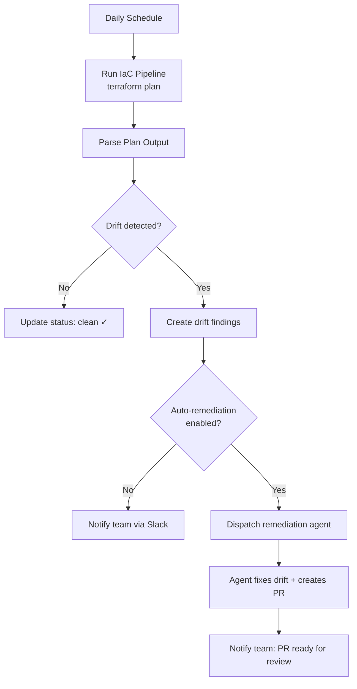
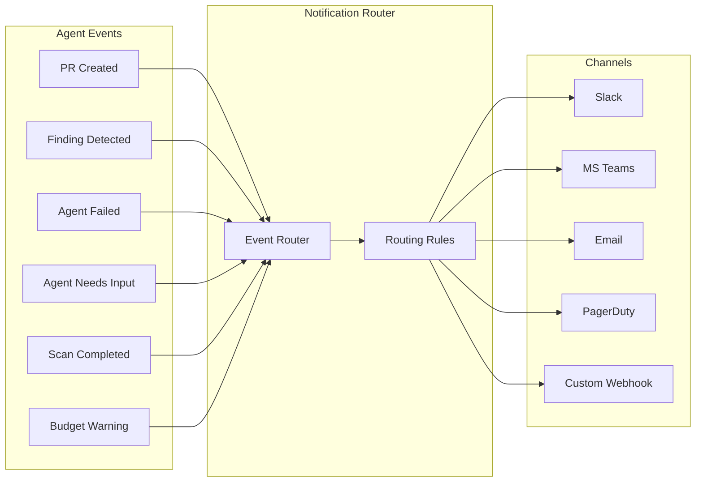

# 第 10 章：Autonomous Operations 与 Notifications

> Scheduling、autonomous use cases、notification routing、escalation chains，以及 daily digests。

---

## 超越 Chat：能够自行运行的 Agents

交互式 chat 更容易出 demo。但最稳定的价值来自**完全 autonomous** 的 agents，它们按 schedule 运行、检测问题、修复问题，并在没有任何人发起对话的情况下汇报结果。

```
Schedule --> Scan --> Finding detected? --> Auto-remediate --> PR created
   |                       |                                     |
   v                       v                                     v
Next scheduled run    Notify team                           Notify team
```

---

## Scheduling

### 示例：Kubernetes CronJob

最简单且最可靠的方式是一个 cron trigger 去调用你的 API：

```yaml
# Kubernetes CronJob — daily drift scan
apiVersion: batch/v1
kind: CronJob
metadata:
  name: daily-drift-scan
  namespace: agent-scheduler
spec:
  schedule: "0 6 * * *"  # Every day at 6:00 UTC
  concurrencyPolicy: Forbid  # Don't overlap
  jobTemplate:
    spec:
      template:
        spec:
          containers:
            - name: trigger
              image: curlimages/curl:latest
              command:
                - curl
                - -X POST
                - -H "Content-Type: application/json"
                - -H "Authorization: Bearer ${SCHEDULER_TOKEN}"
                - "http://api-server/api/v1/internal/scheduled-tasks/drift-scan"
                - -d '{"scope": "all-monitored-repos"}'
          restartPolicy: OnFailure
```

无论你使用哪种 scheduler，模式都相同：外部 trigger 调用一个经过认证的 API endpoint，该 endpoint 查询哪些对象需要扫描（基于已配置的频率和上次扫描时间），然后把任务 dispatch 到 agent queue。

### Scheduling 对比

| Approach | Reliability | Complexity | Catch-Up | Cost | Best For |
|----------|------------|-----------|----------|------|----------|
| **Kubernetes CronJob** | High | Low | Manual | Cluster | K8s-native |
| **AWS EventBridge** | Very High | Low | Built-in | Per-invocation | AWS-native |
| **Azure Timer Functions** | Very High | Low | Built-in | Per-invocation | Azure-native |
| **Temporal Schedules** | Very High | Medium | Built-in | Server cost | Complex workflows |
| **In-process (croner/cron)** | Medium | Lowest | Manual | Free | Simple setups |
| **pg_cron (PostgreSQL)** | High | Low | Manual | Free | DB-centric |

### Scan Frequency 选项

不同 use case 常见的频率如下：

| Frequency | Use Case |
|-----------|----------|
| **Hourly** | 高价值环境、incident response readiness |
| **Daily** | 大多数 compliance 与 drift scanning 的默认频率 |
| **Weekly** | 成本优化、架构评审 |
| **Monthly** | 低变更环境、audit reports |
| **Unmonitored** | Opt-out，不进行自动扫描 |

跟踪每项配置的上次扫描时间和下一次计划扫描时间，以防止重复 dispatch，并在 outage 之后支持 catch-up。

### 防止 Schedule 过载

扫描数百个 repository 时，应错峰 dispatch，避免 queue 被瞬间灌满：

```typescript
async function staggeredDispatch(
  tasks: AgentTask[],
  intervalMs: number = 5000
): Promise<void> {
  for (let i = 0; i < tasks.length; i++) {
    await dispatchTask(tasks[i]);

    if (i < tasks.length - 1) {
      await new Promise(resolve => setTimeout(resolve, intervalMs));
    }
  }
}
```

---

## Autonomous Use Cases

### 1. 持续 Drift Detection



drift scan handler 遵循一个简单的决策树：

1. **No drift**：将这次扫描标记为 clean，更新上次扫描时间戳
2. **Drift detected**：创建 drift findings（resource address、change type、status）
3. **Auto-remediation enabled?**：dispatch 一个 remediation agent 去修复 drift 并创建 PR
4. **Always notify**：无论是否启用 auto-remediation，都向已配置 channel 发送 notification

```typescript
// Pseudocode: drift scan result handling
async function handleDriftScanResult(result: DriftScanResult) {
  if (result.driftResources.length === 0) {
    await markScanClean(result.scanId);
    return;
  }

  // Store drift findings for tracking
  await createDriftFindings(result.driftResources);

  // Auto-remediation if enabled for this repository
  if (result.config.autoRemediate) {
    await dispatchRemediationAgent({
      type: 'drift-remediation',
      repository: result.config.repository,
      driftFindings: result.driftResources,
    });
  }

  // Always notify
  await sendNotification(result.config.notificationChannel, {
    message: formatDriftNotification(result),
  });
}
```

### 2. Scheduled Compliance Scanning

每晚：扫描所有已连接的 cloud accounts，查找 compliance findings。对于每个启用了 compliance scanning 的 account，dispatch 一个任务，并附带已配置的 frameworks（CIS、SOC2、ISO 27001）以及 auto-remediation 偏好。结果写入 data plane 并触发 notifications。

### 3. 定期 Cost Optimization

每周：分析各个 account 的 cloud spend。dispatch 一个 cost analysis agent，用于识别未使用资源、rightsizing candidates，以及 reserved instance coverage gaps。如果启用了 auto-remediation，agent 会创建 PR 以删除或调整资源规模。

### 4. Automated PR Review

事件驱动型，而不是定时型，但仍然是完全 autonomous：当 PR 被创建或更新时，检查 repository 是否启用了 automated review，以及该 PR 是否包含 IaC 变更。如果是，则 dispatch 一个 review agent 来分析变更、运行 validation tools，并发布 review comments。

```typescript
// Example: webhook handler for automated PR review
async function handlePRWebhook(event: PREvent) {
  if (event.action !== 'opened' && event.action !== 'synchronize') return;
  if (!isReviewEnabled(event.repositoryId)) return;
  if (!hasIaCChanges(event.changedFiles)) return;

  await dispatchTask({
    type: 'pr-review',
    payload: {
      pullRequestNumber: event.number,
      repositoryId: event.repositoryId,
      baseBranch: event.baseBranch,
      headBranch: event.headBranch,
    },
  });
}
```

---

## Notifications

Autonomous agents 在后台运行。如果没有 notifications，会出现两种失败模式：

1. **Agent succeeds silently**：没有人 review PR，价值流失
2. **Agent fails silently**：问题不断累积，直到某个人类注意到

### Notification Architecture



### Event Types 与 Severity

按紧急程度对 notification events 进行分类，这样 routing rules 才能把它们导向合适的位置：

| Severity | Meaning | Examples |
|----------|---------|---------|
| **Info** | Agent 完成了工作，扫描 clean 结束 | Drift 已修复，扫描 clean |
| **Warning** | 预算阈值、部分失败、检测到 findings | 检测到 drift，预算超出 |
| **Action** | 需要人工操作，PR review、approval | PR 已创建，agent 需要输入 |
| **Urgent** | 严重失败、关键 security finding | Agent 失败，critical finding |

将每种 event type 映射到默认 severity：

| Event | Default Severity |
|-------|-----------------|
| `pr.created` | Action |
| `scan.completed.clean` | Info |
| `scan.completed.findings` | Warning |
| `drift.detected` | Warning |
| `drift.auto_remediated` | Info |
| `agent.failed` | Urgent |
| `agent.needs_input` | Action |
| `agent.budget_exceeded` | Warning |
| `finding.critical` | Urgent |

每个 notification event 都应携带：type、severity、title、body、metadata（organization、agent、repository、PR URL，如果适用），以及一个可选的 deduplication key，用于防止同一事件重复通知。

### Channel Implementations

每个 channel 都遵循同样的模式：接收一个 notification event，将其格式化为对应平台格式，然后 POST 出去。各 channel 需要关注的关键点如下：

| Channel | API / Protocol | Key Detail |
|---------|---------------|------------|
| **Microsoft Teams** | Adaptive Cards via webhook | 使用 `AdaptiveCard` v1.4，metadata 用 `FactSet`，PR 链接用 `Action.OpenUrl` |
| **Email** (SendGrid/SES) | SMTP or REST API | Subject line：`[SEVERITY] title`。使用 HTML template，并提供 plain-text fallback |
| **PagerDuty** | Events API v2 (`/v2/enqueue`) | 仅对 `urgent` 事件触发。设置 `routing_key`、`severity: 'critical'`，并把 source 设为 agent slug |
| **Generic Webhook** | HTTP POST | 传递 `X-Event-Type` 和 `X-Severity` headers。body 为完整的 `NotificationEvent` JSON |

---

## Notification Routing Rules

Routing rules 决定哪些事件去哪些 channel。每条 rule 需要指定：

- **Filter**：匹配哪些 event types、severities、agents 或 repositories
- **Channel**：发送到哪里（Slack、Teams、email、PagerDuty、webhook）
- **Deduplication window**：在一个时间窗口内防止同一事件重复通知

路由逻辑是：对于每一个 notification event，评估该 organization 的所有 active rules。如果事件匹配某条 rule 的 filter，且没有被 deduplicate，就发送到已配置 channel。

这给了团队精细化控制能力，例如：“所有 `urgent` 事件都发送到 PagerDuty，所有 `pr.created` 事件都发到 Slack 的 `#infra-prs`，daily digests 则发 email。”

---

## Daily Digests

不要为每个事件都发送单独 notification，而是定期发送摘要。一个 daily digest 应包含：

- **Agent sessions**：总数、completed、failed
- **PRs created**：数量，以及最重要 PR 的链接
- **Token usage**：总 token 消耗量，用于 cost tracking
- **Open findings**：新检测到的 findings、已自动修复的 findings
- **Failures**：任何 agent failures，并附带简要上下文

根据内容设定 digest severity：如果存在 failures，则为 `warning`；如果一切正常，则为 `info`。通过同一个 notification system 路由 digests，这样团队就可以选择自己偏好的 channel。

---

## Escalation Chains

对于 critical failures，通过紧急程度逐步升级的 channels 进行 escalation：

```
Minute 0:  Slack notification to #infra-agents channel
Minute 5:  Slack DM to on-call engineer
Minute 15: PagerDuty incident (if unacknowledged)
Minute 30: PagerDuty escalation to team lead
```

```typescript
async function escalate(event: NotificationEvent, level: number = 0) {
  const chain = [
    { channel: 'slack', config: { channel: '#infra-agents' }, delayMs: 0 },
    { channel: 'slack', config: { mentionUsers: ['U_ONCALL'] }, delayMs: 5 * 60_000 },
    { channel: 'pagerduty', config: { routingKey: PD_KEY }, delayMs: 15 * 60_000 },
  ];

  if (level >= chain.length) return;

  const step = chain[level];
  await sendToChannel(step, event);

  if (level + 1 < chain.length) {
    setTimeout(async () => {
      const acknowledged = await isEventAcknowledged(event.dedupeKey);
      if (!acknowledged) {
        await escalate(event, level + 1);
      }
    }, chain[level + 1].delayMs - step.delayMs);
  }
}
```

---

## 下一章

[第 11 章：Testing 与 Hardening →](./11-testing-hardening-zh.md)

---

*Built by the team at [Cloudgeni](https://cloudgeni.ai) — Scale your infrastructure team. With Agents. Safely.*
